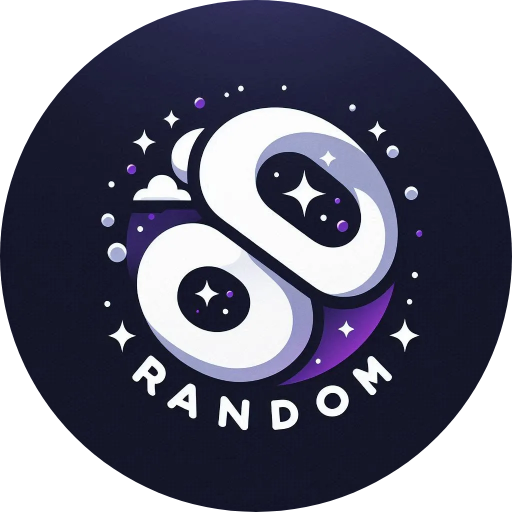

  

  <h1>RNDMCV</h1>
  
An app to help with your resume

  

    <a href="https://rndmcv.vercel.app/">View Demo</a>
    ·
    <a href="https://github.com/svyatoslavw/rndmcv-app/issues/new?assignees=&labels=bug&template=bug.yml&title=%5BBUG%5D+%3Cdescription%3E">Report Bug</a>
    ·
    <a href="https://github.com/svyatoslavw/rndmcv-app/issues/new?assignees=&labels=feature&template=features.yml&title=%5BFEATURE%5D+%3Cdescription%3E">Request Feature</a>
  

   
   
   
   

   RNDMCV is more than just a resume building tool - it's an innovative platform designed to enhance your job search experience. Our goal is to help job seekers like you reach your full potential and land your dream job, while saving time and enjoying the process as much as we do creating it!
 

## ✨ Features
- 🎯 **ATS-Friendly Templates**: Design resumes professionally, AI assistant optimizes them for Applicant Tracking Systems
- 🤖 **AI-Powered**: Smart content suggestions and auto-generation powered by Llama 3.8
- 💳 **100% Free**: No credit card required, no hidden fees
- 🎨 **Customizable**: Many flexible customization sections
- 📱 **Responsive**: Works perfectly on desktop and mobile devices
- 📤 **Export Options**: Download as PDF, share links, and more

## 🛠️ Tech Stack

- [Next.js 14](https://nextjs.org/)
- [TypeScript](https://www.typescriptlang.org/)
- [Tailwind CSS](https://tailwindcss.com/)
- [shadcn/ui](https://ui.shadcn.com/)
- [Redux Toolkit](https://redux-toolkit.js.org/)
- [Prisma](https://prisma.io/)
- [Postgres](https://www.postgresql.org/)
- [Vercel](https://vercel.com/)

## 👩🏽‍💻 Contributing

- Contributions make the open source community such an amazing place to learn, inspire, and create.
- Any contributions you make are greatly appreciated.
- Check out our [contribution guidelines](/CONTRIBUTING.md) for more information.

## 📄 License
This project is licensed under the MIT License - see the [LICENSE](LICENSE) file for details.
